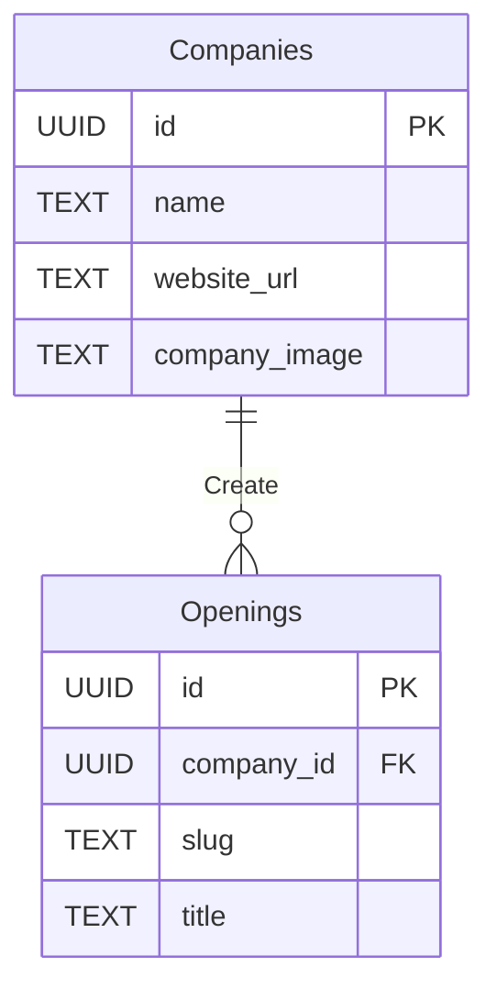

# Getting Started

This is a supabase CLI project, powered by deno and PostgreSQL. 

If you wish to run the project locally please download and install the suabase CLI package and docker for your platform and start the development server using 

```bash
supabase start
```

# CONSIDERATIONS

- __Opening slug:__ Should be generated using the following pattern
```javascript
  const slug = `${company_shortname}-${opening.title}-${timestamp}`
```

# Database Model

> :warning: Initially both companies and Openings will be crawled and created by us from appropriate sources hiring remotely in LatAm

> Ids are generated following this guide (https://blog.daveallie.com/ulid-primary-keys) and stored in a column of type UUID on postgresql


